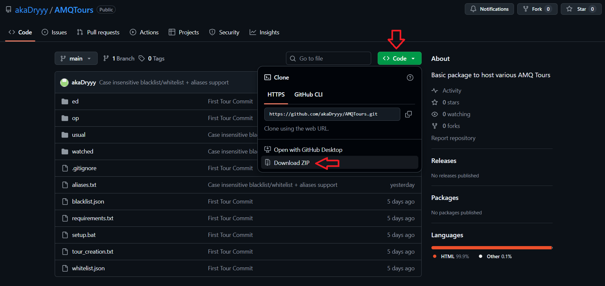

# PREREQUISITES

Install python, you will need it for all the tools

# Download the necessary tools

- Download the .zip as seen by image
- Extract it
- (ONE TIME ONLY) Run the provided `setup.bat` file, or you can `pip install -r requirements.txt` if you can use the command line
- You can now host tours, more instructions on each file and its usage in the respective folder readme